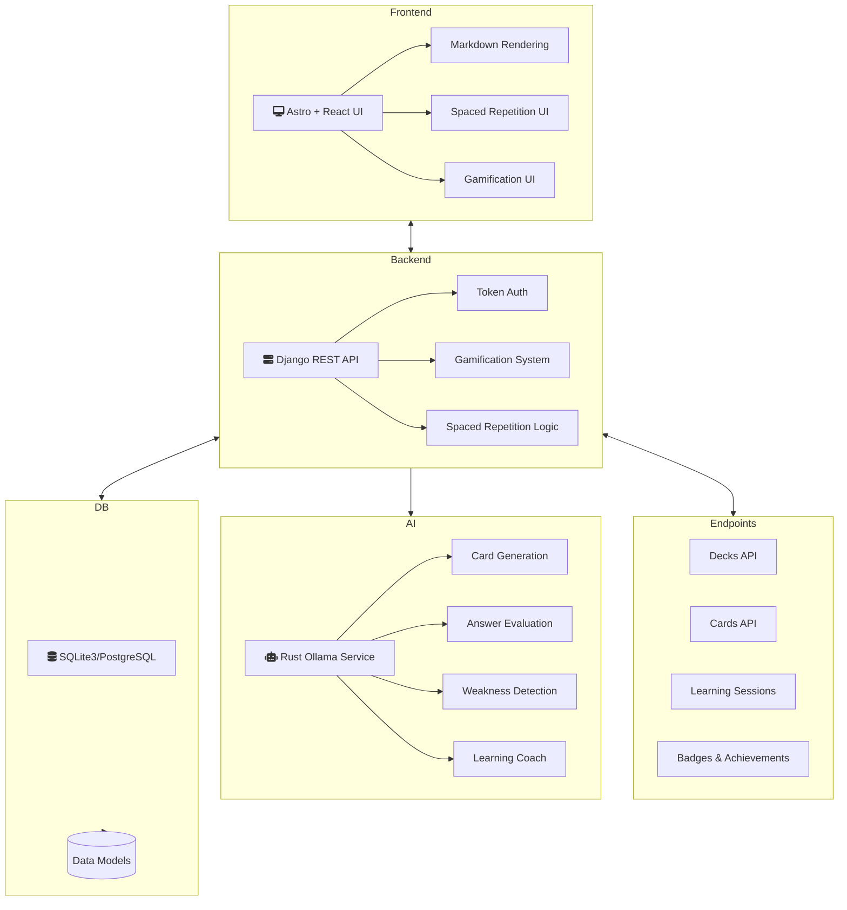

# Flashcards – Intelligent Learning App

## 📚 Project Overview

Flashcards is a modular, AI-enhanced learning application designed to make studying more effective, engaging, and developer-friendly. The project consists of three main components:

- **Backend (Django, Python)**  
  Provides the core API, user management, spaced repetition logic, gamification systems, and handles communication with the AI module.

- **Frontend (Astro + React)**  
  A fast, modern UI that renders Markdown-based flashcards with syntax highlighting, interactive components, and gamified progress tracking.

- **AI Module (Rust)**  
  Responsible for generating flashcard content automatically using AI models based on user-provided topics. The AI logic runs in a standalone Rust service, allowing for efficient, isolated processing.

## 🏗️ Architecture

---

### 🔍 Key Features

- AI-powered flashcard generation
- Markdown support with code syntax highlighting
- Spaced repetition system (SRS)
- Gamification with badges and XP
- Clean separation of concerns via Dockerized architecture

---

> This project is structured for future extensibility, allowing each component to evolve independently. The backend and AI service run in isolated containers, while the frontend can be deployed separately via NGINX or any static host.