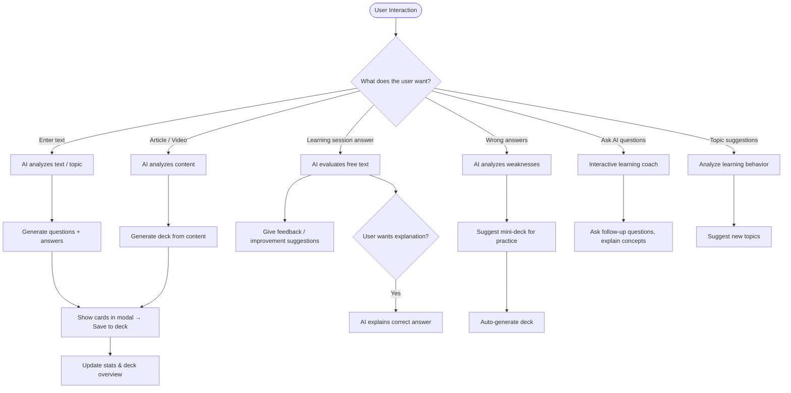

# Flashcards AI Service

A Rust-based AI service for generating intelligent flashcards using Ollama. This service provides automated content generation for learning applications with support for multiple languages and customizable generation rules.

## 🚀 Core Features

- **AI-Powered Flashcard Generation**
  - Automatic content analysis and card creation
  - Multi-language support (German, English, and more)
  - Customizable generation rules
  - Streaming response processing

- **Content Types**
  - Text-based topic analysis
  - Article and video content extraction
  - Learning session answer evaluation
  - Weakness pattern recognition
  - Interactive learning coach

- **Quality Control**
  - Structured JSON output
  - Markdown formatting for questions
  - Plain text answers for readability
  - Character limit enforcement
  - Code syntax highlighting

## 🔐 API Endpoints

### Flashcard Generation
- `POST /generate` - Generate flashcards from text prompt
- `GET /` - Health check endpoint

## 🏗️ Architecture

## 🔍 Service Features

### Content Generation
- **Topic Analysis**: Automatically extracts key concepts from text
- **Question Variety**: Multiple question types (definitions, code outputs, comparisons)
- **Language Detection**: Automatic language recognition and response matching
- **Quality Control**: Enforces answer length limits and formatting standards

### Learning Enhancement
- **Answer Evaluation**: AI-powered assessment of free-text responses
- **Weakness Detection**: Identifies learning gaps and suggests practice materials
- **Personalized Coaching**: Interactive AI assistant for learning support
- **Progress Analysis**: Learning behavior analysis for topic recommendations

### Technical Features
- **Streaming Processing**: Real-time response handling from Ollama
- **Error Handling**: Robust error management and recovery
- **Configuration**: Flexible rule-based generation system
- **Performance**: Optimized for low-latency responses

## 🛠️ Technology Stack

- **Language**: Rust
- **AI Backend**: Ollama with Mistral model
- **HTTP Server**: Axum framework
- **JSON Processing**: Serde
- **HTTP Client**: Reqwest
- **Async Runtime**: Tokio

## 📝 Configuration

### Generation Rules
The service uses rules defined in `rules/generate_rule.md` to ensure consistent, high-quality output:

- **Answer Length**: Maximum 200 characters
- **Question Format**: Markdown with syntax highlighting
- **Language Matching**: Automatic language detection and response
- **Content Types**: Various question types for comprehensive learning

### Model Configuration
- **Default Model**: Mistral
- **Temperature**: Optimized for consistent, structured output
- **Streaming**: Enabled for real-time processing
- **Error Recovery**: Automatic retry and fallback mechanisms

## 🔒 Security & Performance

- **Input Validation**: Comprehensive prompt validation
- **Rate Limiting**: Built-in request throttling
- **Error Handling**: Graceful degradation and error reporting
- **Resource Management**: Efficient memory and CPU usage
- **Monitoring**: Built-in logging and performance metrics

## 🔄 Integration

The AI service integrates seamlessly with the Django backend and frontend applications, providing a complete learning ecosystem with automated content generation and intelligent learning assistance.
